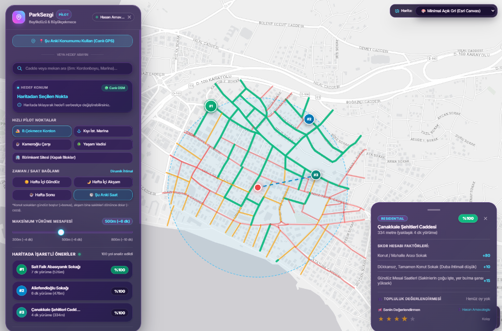
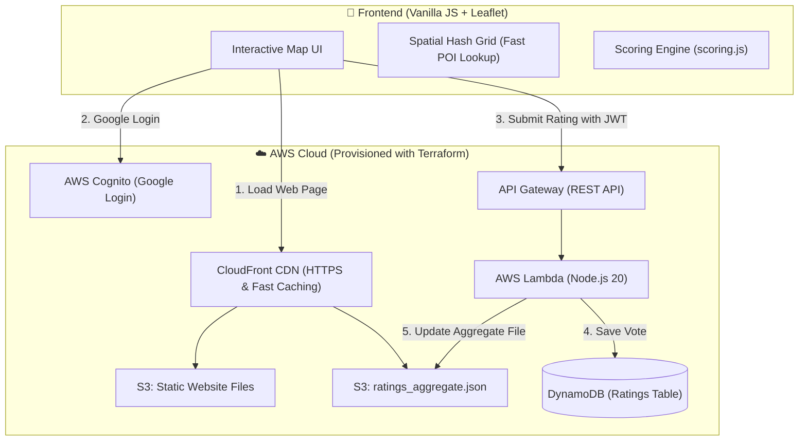

# 🚗 ParkSezgi — Smart Free Street Parking Finder

[](https://github.com/VersionTV/park-sezgi/actions/workflows/ci.yml)
[](LICENSE)
[](https://aws.amazon.com)
[](https://www.terraform.io)
[](https://leafletjs.com)

> 🌐 **Live Demo:** **[https://d1msnatkb8tlnq.cloudfront.net](https://d1msnatkb8tlnq.cloudfront.net)**

<p align="center">
  
</p>

## 📌 About the Project

Hi! I am a recent Computer Engineering graduate. I built **ParkSezgi** both to solve a real-world everyday problem—finding free, legal street parking near crowded spots without circling for hours—and to get practical, hands-on experience with **AWS Cloud, Infrastructure as Code (Terraform), and CI/CD pipelines**.

Instead of building another generic CRUD app, I wanted to build an end-to-end system that handles map data, spatial indexing, a scoring algorithm, and a serverless backend running within the **AWS Free Tier ($0/month)**.

---

## 💡 How It Works

When you select a destination on the map, ParkSezgi analyzes all streets within a 5–8 minute walking distance (300m–800m):

1. **Street Type Baseline:** Residential streets (`residential`, `living_street`) start with higher scores. Main avenues (`primary`, `secondary`) are penalized or marked red because parking there is usually prohibited or blocked.
2. **Commercial Density Penalty:** Uses a dataset of **100,000+ local venues** (cafes, markets, restaurants) harvested from Overture Maps. Streets with heavy shopfronts get points deducted due to customer traffic and illegal shopkeeper bollards.
3. **Time of Day Context:** 
   - ☀️ **Daytime:** Residential streets get a bonus (+15) because residents are away at work.
   - 🌙 **Evening:** Residential streets get penalized (-20) as residents return home.
   - 🕒 **"Current Time" mode:** Automatically checks the device clock and day of the week.
4. **Community Rating (Crowdsourcing):** Users can log in with Google to rate streets (1–5 stars) or leave notes (e.g. *"There are parking pockets on the right"*).

---

## 🏛️ System Architecture



---

## ☁️ Cloud & DevOps Highlights (What I Built & Learned)

### 1. Infrastructure as Code (Terraform)
All AWS resources are defined in code in the [`infra/`](infra/) directory. Instead of manually clicking in the AWS Console, I can set up or tear down the entire environment with Terraform:
- **Modular files:** `main.tf`, `dynamodb.tf`, `cognito.tf`, `lambda.tf`, `api_gateway.tf`, `s3_cloudfront.tf`.
- **Security:** Sensitive variables (like Google OAuth secrets) are marked `sensitive = true`, and Terraform state files (`.tfstate`) are excluded from Git.

### 2. Serverless Backend & Cost Optimization ($0/month)
As a student/new graduate, I wanted zero monthly server bills. I designed the architecture to stay strictly within the **AWS Free Tier**:
- **DynamoDB On-Demand (`PAY_PER_REQUEST`):** No fixed monthly hourly fee. Only pays per read/write, well within the free tier.
- **S3 + CloudFront CDN Caching:** When hundreds of streets are shown on the map, querying DynamoDB for every street would quickly consume database capacity. Instead, Lambda writes an aggregated summary (`ratings_aggregate.json`) to S3, and clients read it from the CloudFront CDN cache. **Read cost = $0.**
- **AWS Lambda (Node.js 20 ESM):** Runs only when a user votes or deletes a vote. Takes ~35ms to execute.

### 3. Authentication with AWS Cognito & Google
- Users can browse the map anonymously.
- Voting requires signing in with **Google** via **AWS Cognito User Pools** (OAuth 2.0).
- API Gateway uses a **Cognito Authorizer** to verify the user's JWT token before allowing requests through to Lambda.

### 4. CI/CD with GitHub Actions
I set up two automated workflows in [`.github/workflows/`](.github/workflows/):
- **CI Pipeline (`ci.yml`):** Runs on every push and pull request. It checks JavaScript syntax, runs the unit test suite (`test_scoring.js`), and validates Terraform formatting (`terraform fmt -check`, `terraform validate`).
- **CD Pipeline (`deploy.yml`):** When code is pushed to the `master` branch, it automatically zips and updates the Lambda function, uploads the frontend files to S3, and invalidates the CloudFront cache.

---

## 🧠 Algorithmic Problem Solved: In-Memory Spatial Indexing

**The Challenge:** Calculating distances between ~200 visible streets and 100,000+ venue coordinates on every map movement caused noticeable frame lag in the browser ($200 \times 100{,}000 = 20{,}000{,}000$ operations).

**My Solution:** I implemented an **$O(1)$ Spatial Hash Grid** in vanilla JavaScript:
- The coordinate plane is divided into grid cells by rounding:
  $$\text{Key} = \lfloor \text{lat} \times 100 \rfloor \text{ \_ } \lfloor \text{lon} \times 100 \rfloor$$
- When checking a street, the code only inspects venues inside that cell and its 8 neighboring cells.
- **Result:** Initial index builds in **~17 ms**, and checking 200 streets takes **less than 6 ms** without any external libraries.

*(I documented this and other trade-offs in the [`docs/adr/`](docs/adr/) folder).*

---

## 🛠️ Tech Stack

- **Cloud (AWS):** S3, CloudFront, API Gateway, Lambda, DynamoDB, Cognito
- **DevOps & IaC:** Terraform, GitHub Actions, AWS CLI, Git
- **Frontend:** Vanilla JavaScript (ES6+), Leaflet.js, OpenStreetMap, Tailwind CSS
- **Data & Tools:** Python (Overture Maps POI harvester script), Node.js

---

## 🚀 Running Locally

```bash
# 1. Clone the repo
git clone https://github.com/VersionTV/park-sezgi.git
cd park-sezgi

# 2. Start the local server
node server.js
```

Open **`http://localhost:5500`** in your browser.

### Running the Test Suite
```bash
node test_scoring.js
```

---

## 📄 License
This project is open source and available under the [MIT License](LICENSE).
