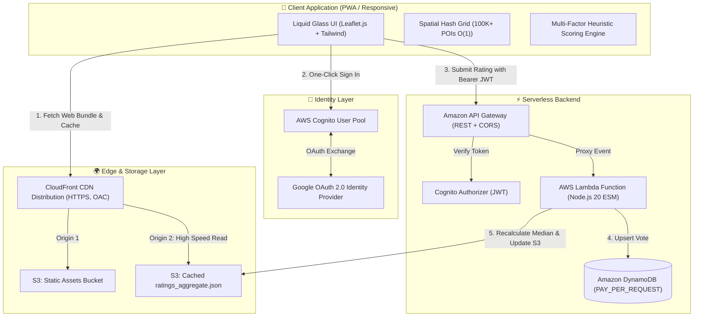

# 🚗 ParkSezgi — Cloud-Native Free Street Parking Recommender

[](https://github.com/VersionTV/park-sezgi/actions/workflows/ci.yml)
[](LICENSE)
[](https://aws.amazon.com)
[](https://www.terraform.io)
[](https://leafletjs.com)

> **Live Production Demo:** **[https://d1msnatkb8tlnq.cloudfront.net](https://d1msnatkb8tlnq.cloudfront.net)**

ParkSezgi is an intelligent, privacy-first geospatial decision system designed to predict and recommend legal, free street parking spots within a 5–8 minute walking radius of high-density urban destinations.

Built with a **Cloud-Native Serverless Architecture** orchestrated via **Terraform (IaC)**, it processes over **100,000+ commercial venues** in real-time with an in-memory $O(1)$ spatial hash grid and incorporates a community review engine with anti-manipulation safeguards running at **$0 monthly operating cost** within AWS Free Tier limits.

---

## 🏛️ System Architecture



---

## ⚡ Key Engineering Highlights

### 1. $O(1)$ Spatial Hash Grid Indexing
- Rather than running costly geometric scans across 100,000+ POIs on every frame, coordinates are hashed into discrete geographic bounding buckets:
  $$\text{Key} = \lfloor \text{lat} \times 100 \rfloor \text{ \_ } \lfloor \text{lon} \times 100 \rfloor$$
- **Benchmark:** Indexes 100,542 venues in **17 ms** and queries nearby commercial density across 300+ streets in under **5.7 ms** on the client.

### 2. Multi-Factor Street Scoring Engine
The heuristic engine ([`scoring.js`](file:///C:/Users/versi/.gemini/antigravity/scratch/park-bulucu/scoring.js)) evaluates real-time parking viability using 5 discrete tiers:
- **Highway Base Priority:** High baseline for residential streets; automatic disqualification for arterial routes.
- **Commercial Density Penalty:** Commercial venues (cafes, markets, clinics) within 85m penalize availability due to customer vehicle circulation and business bollards.
- **Diurnal Resident Model:** Dynamic temporal offsets adjust scores based on commute hours (+15 daytime bonus when residents leave, -20 evening penalty when residents return).
- **Geometric Factors:** One-way streets and dead-end alleys receive flow stability bonuses.
- **Topological Exclusion:** Automatic detection of private gated communities, ports, and private marina zones.

### 3. $0 Operational Cost Read-Heavy Architecture
- Harita üzerinde aynı anda 50–100 sokak görüntülenir. Her sokak için veritabanı sorgusu atmak maliyet patlamasına yol açar.
- **Çözüm:** Oylar Lambda aracılığıyla DynamoDB'ye yazıldığında sokak medyanı ve dağılımı anlık hesaplanıp tek bir statik `ratings_aggregate.json` olarak S3'e yazılır.
- İstemciler bu dosyayı CloudFront CDN önbelleği üzerinden tek bir HTTP GET ile indirir. **Okuma maliyeti: $0.**

---

## 🛡️ Community Rating & Anti-Abuse Defenses

To complement map data with crowdsourced ground truth (e.g., parking pockets on main avenues, newly placed bollards):

| Defense Layer | Implementation | Purpose |
|---|---|---|
| **Layer 1: Identity Bound** | Google OAuth2 via AWS Cognito | Prevents infinite anonymous spam |
| **Layer 2: Atomic Upsert** | DynamoDB Composite Key (`PK: wayId`, `SK: userId`) | Exactly 1 vote per user per street |
| **Layer 3: Rate Limiting** | API Gateway Token Bucket (50 req/s, 100 burst) | Bot flood prevention |
| **Layer 4: Robust Statistics** | Median instead of Mean | Outlier resilience against targeted brigading |
| **Layer 5: Confidence Threshold** | Minimum 3-vote threshold ($N \ge 3$) | Low-sample noise cancellation |

---

## 🛠️ Technology Stack

- **Frontend:** Vanilla JavaScript (ES6+), Leaflet.js, OpenStreetMap, Tailwind CSS, Apple Liquid Glass Design
- **Data Engineering:** Python (Overture Maps Foundation geo-harvester, DuckDB, Parquet)
- **Cloud Infrastructure (AWS):**
  - **IaC:** Terraform v1.5+ (AWS Provider 5.x)
  - **Compute:** AWS Lambda (Node.js 20.x ESM, AWS SDK v3)
  - **Database:** Amazon DynamoDB (`PAY_PER_REQUEST`, TTL enabled)
  - **API:** Amazon API Gateway (REST API + CORS + Cognito Authorizer)
  - **Auth:** Amazon Cognito User Pool + Google Identity Provider
  - **Storage & CDN:** Amazon S3 + Amazon CloudFront (Origin Access Control)
- **CI/CD:** GitHub Actions (Automated unit tests, syntax checks, Terraform validation, zero-downtime deployment)

---

## 🚀 Local Development Setup

### Prerequisites
- Node.js 18+
- Python 3.10+ (for data harvesting scripts)
- AWS CLI v2 & Terraform (for infrastructure deployment)

### Running Locally
```bash
# Clone the repository
git clone https://github.com/VersionTV/park-sezgi.git
cd park-sezgi

# Start the zero-dependency local Node.js development server
node server.js
```

Open your browser at:
👉 **`http://localhost:5500`**

### Running Test Suite
```bash
# Run heuristic algorithm & POI penalty test suite
node test_scoring.js
```

---

## 📦 Deployment & CI/CD

Deployments are automated via GitHub Actions:
- **Pull Requests:** Trigger automated unit tests, syntax validation, and `terraform fmt/validate`.
- **Main Branch Push:** Automatically builds Lambda packages, uploads static assets to S3, and invalidates CloudFront caches.

Manual deployment can also be performed via PowerShell:
```powershell
# Deploy frontend changes to S3 & clear CDN cache
.\deploy.ps1 -Frontend

# Deploy Lambda backend updates
.\deploy.ps1 -Backend

# Apply full Terraform infrastructure
.\deploy.ps1 -Apply
```

---

## 📄 License
This project is licensed under the [MIT License](LICENSE).
